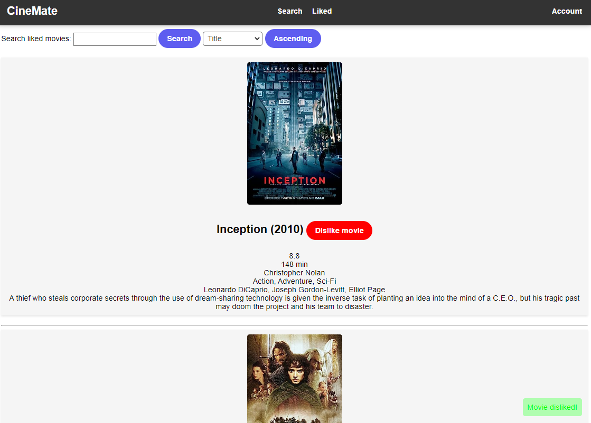

# Cinemate

Web-based application I built for a school project. Search for movies and TV shows and add them to liked list. Explore movies with the *I'm feeling lucky*. Requires user to make an account in order to use the app.

## Features
- Movies and TV shows search with the [OMDB API](https://www.omdbapi.com/)
- I'm feeling lucky with [TMDB API](https://www.themoviedb.org/)
- Liked list
    - Search the list (using Levenshtein for fuzzy searching)
    - Sort the list
- Basic user auth

## Tech stack
- Python Flask
- TinyDB - was to lazy to impliment actual RDBMS, also no password hashing :(
- Ajax
- HTML, CSS, JS - nothing special for the front-end. UI/UX wasn't really my priority with this project, this explains the not so preety visuals of it

## Usage
1. Clone the repo
   ```sh
   git clone https://github.com/lanlebar/cinemate.git
   ```
2. Move to directory
   ```sh
   cd cinemate
   ```
3. Run main.py
   ```sh
   python main.py
   ```
4. app is running on 127.0.0.1:8080

## Gallery


